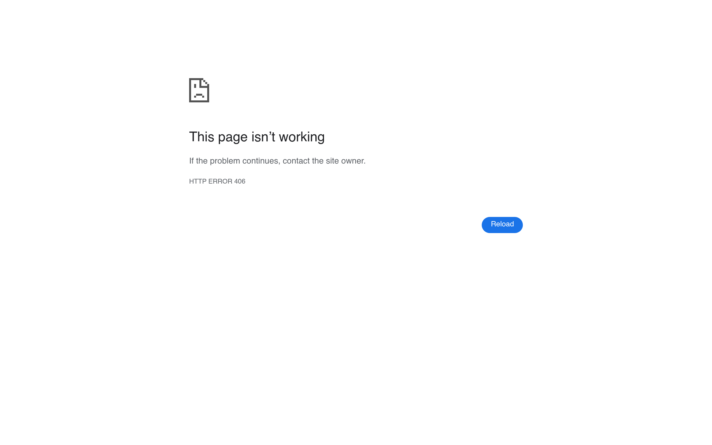

# duolingo Design System

You are building UI for **duolingo**. Light-themed, neutral palette, sans-serif typography (KaTeX_Caligraphic), compact density on a 4px grid, expressive motion.

## Visual Reference

**IMPORTANT**: Study ALL screenshots below before writing any UI. Match colors, typography, spacing, layout, and motion exactly as shown.

### Homepage



> Read `references/DESIGN.md` for full token details.

## Design Philosophy

- **Layered depth** — use shadow tokens to create a sense of physical layering. Each elevation level has a specific shadow.
- **Gradient accents** — gradients are used thoughtfully for emphasis, not decoration.
- **Type pairing** — KaTeX_Caligraphic for body/UI text, KaTeX_AMS for headings/display. Never introduce a third typeface.
- **compact density** — 4px base grid. Every dimension is a multiple of 4.
- **neutral palette** — the color temperature runs neutral, matching the sans-serif typography.
- **Expressive motion** — animations are an integral part of the experience. Use spring physics and layout animations.

## Color System

### Core Palette

| Role | Token | Hex | Use |
|------|-------|-----|-----|

### Status Colors

| Status | Hex | Use |
|--------|-----|-----|
| Success | `#00b086` | Confirmations, positive trends |

### CSS Variable Tokens

```css
--__internal__border-radius: var(--web-ui_button-border-radius,12px);
--__internal__border-radius: var(--web-ui_button-border-radius,8px);
--__internal__border-radius: var(--web-ui_button-border-radius,16px);
--__internal__border-radius: var(--web-ui_button-border-radius,8px);
--__internal__border-radius: var(--web-ui_button-border-radius,12px);
--__internal__switchable__border-color: var(--__internal__border-color);
--__internal__border-radius: var(--web-ui_button-border-radius,8px);
--web-ui_popover-border-radius: 5px;
--web-ui_button-border-radius: 16px;
--web-ui_button-border-radius: 12px;
--web-ui_button-background-color: rgb(var(--color-iguana));
--web-ui_button-border-color: rgb(var(--color-blue-jay));
--web-ui_button-background-color: rgb(var(--color-owl));
--web-ui_button-border-color: rgb(var(--color-blue-jay));
--web-ui_button-border-color: rgb(var(--color-blue-jay));
--web-ui_button-background-color: rgb(var(--color-facebook));
--web-ui_button-border-color: rgb(var(--color-facebook-dark));
--web-ui_button-background-color: rgb(var(--color-bee));
--web-ui_button-background-color-disabled: rgb(var(--color-bee),0.4);
--web-ui_button-border-color: rgb(var(--color-camel));
```

## Typography

### Font Stack

- **KaTeX_Caligraphic** — Heading 1, Heading 2, Heading 3
- **KaTeX_AMS** — Body, Caption

### Font Sources

```css
@font-face {
  font-family: "KaTeX_AMS";
  src: url("fonts/KaTeX_AMS-Regular.woff2") format("woff2");
  font-weight: 400;
}
@font-face {
  font-family: "KaTeX_Caligraphic";
  src: url("fonts/KaTeX_Caligraphic-700.woff2") format("woff2");
  font-weight: 700;
}
@font-face {
  font-family: "KaTeX_Caligraphic";
  src: url("fonts/KaTeX_Caligraphic-Regular.woff2") format("woff2");
  font-weight: 400;
}
@font-face {
  font-family: "KaTeX_Fraktur";
  src: url("fonts/KaTeX_Fraktur-700.woff2") format("woff2");
  font-weight: 700;
}
@font-face {
  font-family: "KaTeX_Fraktur";
  src: url("fonts/KaTeX_Fraktur-Regular.woff2") format("woff2");
  font-weight: 400;
}
@font-face {
  font-family: "KaTeX_Main";
  src: url("fonts/KaTeX_Main-700.woff2") format("woff2");
  font-weight: 700;
}
@font-face {
  font-family: "KaTeX_Main";
  src: url("fonts/KaTeX_Main-Regular.woff2") format("woff2");
  font-weight: 400;
}
@font-face {
  font-family: "KaTeX_Math";
  src: url("fonts/KaTeX_Math-700.woff2") format("woff2");
  font-weight: 700;
}
@font-face {
  font-family: "KaTeX_Math";
  src: url("fonts/KaTeX_Math-Regular.woff2") format("woff2");
  font-weight: 400;
}
@font-face {
  font-family: "KaTeX_SansSerif";
  src: url("fonts/KaTeX_SansSerif-700.woff2") format("woff2");
  font-weight: 700;
}
@font-face {
  font-family: "KaTeX_SansSerif";
  src: url("fonts/KaTeX_SansSerif-Regular.woff2") format("woff2");
  font-weight: 400;
}
@font-face {
  font-family: "KaTeX_Script";
  src: url("fonts/KaTeX_Script-Regular.woff2") format("woff2");
  font-weight: 400;
}
@font-face {
  font-family: "KaTeX_Size1";
  src: url("fonts/KaTeX_Size1-Regular.woff2") format("woff2");
  font-weight: 400;
}
@font-face {
  font-family: "KaTeX_Size2";
  src: url("fonts/KaTeX_Size2-Regular.woff2") format("woff2");
  font-weight: 400;
}
@font-face {
  font-family: "KaTeX_Size3";
  src: url("fonts/KaTeX_Size3-Regular.woff2") format("woff2");
  font-weight: 400;
}
@font-face {
  font-family: "KaTeX_Size4";
  src: url("fonts/KaTeX_Size4-Regular.woff2") format("woff2");
  font-weight: 400;
}
@font-face {
  font-family: "KaTeX_Typewriter";
  src: url("fonts/KaTeX_Typewriter-Regular.woff2") format("woff2");
  font-weight: 400;
}
```

### Type Scale

| Role | Family | Size | Weight |
|------|--------|------|--------|
| Heading 1 | KaTeX_Caligraphic | 64px | 700 |
| Heading 2 | KaTeX_Caligraphic | 48px | 700 |
| Heading 3 | KaTeX_Caligraphic | 36px | 700 |
| Body | KaTeX_AMS | 15px | 400 |
| Caption | KaTeX_AMS | 14px | 400 |

### Typography Rules

- Body/UI: **KaTeX_Caligraphic**, Headings: **KaTeX_AMS** — these are the only display fonts
- Max 3-4 font sizes per screen
- Headings: weight 600-700, body: weight 400
- Use color and opacity for text hierarchy, not additional font sizes
- Line height: 1.5 for body, 1.2 for headings

## Spacing & Layout

### Base Grid: 4px

Every dimension (margin, padding, gap, width, height) must be a multiple of **4px**.

### Spacing Scale

`2, 4, 6, 8, 10, 12, 14, 16, 18, 20, 22, 24` px

### Spacing as Meaning

| Spacing | Use |
|---------|-----|
| 4-8px | Tight: related items (icon + label, avatar + name) |
| 12-16px | Medium: between groups within a section |
| 24-32px | Wide: between distinct sections |
| 48px+ | Vast: major page section breaks |

### Border Radius

Scale: `.15em, 2px, 5px, 6px, 8px, 12px, inherit, 7px, 16px, 18%, 18px, 30%, 98px`
Default: `inherit`

### Container

Max-width: `1065px`, centered with auto margins.

### Breakpoints

| Name | Value |
|------|-------|
| sm | 530px |
| md | 699px |
| md | 700px |
| md | 768px |
| lg | 980px |
| xl | 1065px |
| xl | 1080px |
| 2xl | 1440px |

Mobile-first: design for small screens, layer on responsive overrides.

## Component Patterns

### Card

```css
.card {
  background: #f9fafb;
  border-radius: inherit;
  padding: 16px;
  box-shadow: 0 var(--__internal__lip-width)0;
}
```

```html
<div class="card">
  <h3>Card Title</h3>
  <p>Card content goes here.</p>
</div>
```

### Button

```css
/* Primary */
.btn-primary {
  background: #cccccc;
  color: #cccccc;
  border-radius: inherit;
  padding: 8px 16px;
  font-weight: 500;
  transition: opacity 150ms ease;
}
.btn-primary:hover { opacity: 0.9; }

/* Ghost */
.btn-ghost {
  background: transparent;
  border: 1px solid #cccccc;
  color: #cccccc;
  border-radius: inherit;
  padding: 8px 16px;
}
```

```html
<button class="btn-primary">Get Started</button>
<button class="btn-ghost">Learn More</button>
```

### Input

```css
.input {
  background: #cccccc;
  border: 1px solid #cccccc;
  border-radius: inherit;
  padding: 8px 12px;
  color: #cccccc;
  font-size: 14px;
}
.input:focus { border-color: var(--accent); outline: none; }
```

```html
<input class="input" type="text" placeholder="Search..." />
```

### Badge / Chip

```css
.badge {
  display: inline-flex;
  align-items: center;
  padding: 4px 8px;
  border-radius: 9999px;
  font-size: 12px;
  font-weight: 500;
  background: #f9fafb;
  color: #6b7280;
}
```

```html
<span class="badge">New</span>
<span class="badge">Beta</span>
```

### Modal / Dialog

```css
.modal-backdrop { background: rgba(0, 0, 0, 0.6); }
.modal {
  background: #f9fafb;
  border-radius: 98px;
  padding: 24px;
  max-width: 480px;
  width: 90vw;
  box-shadow: 0 4px 0 rgb(var(--color-unknown-048fd1));
}
```

```html
<div class="modal-backdrop">
  <div class="modal">
    <h2>Dialog Title</h2>
    <p>Dialog content.</p>
    <button class="btn-primary">Confirm</button>
    <button class="btn-ghost">Cancel</button>
  </div>
</div>
```

### Table

```css
.table { width: 100%; border-collapse: collapse; }
.table th {
  text-align: left;
  padding: 8px 12px;
  font-weight: 500;
  font-size: 12px;
  color: #6b7280;
  text-transform: uppercase;
  letter-spacing: 0.05em;
  border-bottom: 1px solid #cccccc;
}
.table td {
  padding: 12px;
  border-bottom: 1px solid #cccccc;
}
```

```html
<table class="table">
  <thead><tr><th>Name</th><th>Status</th><th>Date</th></tr></thead>
  <tbody>
    <tr><td>Item One</td><td>Active</td><td>Jan 1</td></tr>
    <tr><td>Item Two</td><td>Pending</td><td>Jan 2</td></tr>
  </tbody>
</table>
```

### Navigation

```css
.nav {
  display: flex;
  align-items: center;
  gap: 8px;
  padding: 12px 16px;
}
.nav-link {
  color: #6b7280;
  padding: 8px 12px;
  border-radius: inherit;
  transition: color 150ms;
}
```

```html
<nav class="nav">
  <a href="/" class="nav-link active">Home</a>
  <a href="/about" class="nav-link">About</a>
  <a href="/pricing" class="nav-link">Pricing</a>
  <button class="btn-primary" style="margin-left: auto">Get Started</button>
</nav>
```

## Animation & Motion

This project uses **expressive motion**. Animations are part of the design language.

### CSS Animations

- `qnlsp`
- `tj_TT`
- `_2xhhK`
- `_3wL1o`
- `EJauM`

### Motion Tokens

- **Duration scale:** `.2s`, `.3s`, `.4s`, `.6s`, `.75s`, `1.2s`, `2s`, `200ms`, `250ms`, `300ms`, `400ms`, `500ms`, `700ms`
- **Easing functions:** `ease-in-out`, `cubic-bezier(.35,1.8,.35,.83)`, `ease-out`, `ease-in`, `cubic-bezier(.22,1,.36,1)`
- **Animated properties:** `filter`, `transform`

### Motion Guidelines

- **Duration:** Use values from the duration scale above. Short (.2s) for micro-interactions, long (700ms) for page transitions
- **Easing:** Use `ease-in-out` as the default easing curve
- **Direction:** Elements enter from bottom/right, exit to top/left
- **Reduced motion:** Always respect `prefers-reduced-motion` — disable animations when set

## Depth & Elevation

### Shadow Tokens

- Subtle: `0 2px 0`
- Subtle: `0 2px 0 var(--__internal__border-color)`
- Raised (cards, buttons): `0 var(--__internal__lip-width)0`
- Raised (cards, buttons): `0 3px 0 1px`
- Raised (cards, buttons): `inset 0 0 0 3px var(--latex-blank-border-color-light,rgb(var(--color-blue-jay)))`
- Raised (cards, buttons): `inset 0 0 0 3px var(--latex-blank-border-color-dark,rgb(var(--color-blue-jay)))`

### Z-Index Scale

`1, 2, 10, 100, 300, 310, 315, 322, 324`

Use these exact values — never invent z-index values.

## Anti-Patterns (Never Do)

- **No blur effects** — no backdrop-blur, no filter: blur()
- **No zebra striping** — tables and lists use borders for separation
- **No invented colors** — every hex value must come from the palette above
- **No arbitrary spacing** — every dimension is a multiple of 4px
- **No extra fonts** — only KaTeX_Caligraphic and KaTeX_AMS are allowed
- **No arbitrary border-radius** — use the scale: .15em, 2px, 5px, 6px, 8px, 12px, 7px, 16px, 18px, 98px
- **No opacity for disabled states** — use muted colors instead

## Workflow

1. **Read** `references/DESIGN.md` before writing any UI code
2. **Pick colors** from the Color System section — never invent new ones
3. **Set typography** — KaTeX_Caligraphic, KaTeX_AMS only, using the type scale
4. **Build layout** on the 4px grid — check every margin, padding, gap
5. **Match components** to patterns above before creating new ones
6. **Apply elevation** — use shadow tokens
7. **Validate** — every value traces back to a design token. No magic numbers.

## Brand Spec

- **Favicon:** `https://d35aaqx5ub95lt.cloudfront.net/images/duolingo-touch-icon2.png`
- **Site URL:** `https://duolingo.com`
- **Brand typeface:** KaTeX_Caligraphic

## Quick Reference

```
Background:     (not extracted)
Surface:        (not extracted)
Text:           (not extracted) / (not extracted)
Accent:         (not extracted)
Border:         (not extracted)
Font:           KaTeX_Caligraphic
Spacing:        4px grid
Radius:         inherit
Components:     0 detected
```

## When to Trigger

Activate this skill when:
- Creating new components, pages, or visual elements for duolingo
- Writing CSS, Tailwind classes, styled-components, or inline styles
- Building page layouts, templates, or responsive designs
- Reviewing UI code for design consistency
- The user mentions "duolingo" design, style, UI, or theme
- Generating mockups, wireframes, or visual prototypes

---

# Full Reference Files

> Every output file is embedded below. Claude has full design system context from /skills alone.

## Design System Tokens (DESIGN.md)

# duolingo DESIGN.md

> Auto-generated design system — reverse-engineered via static analysis by skillui.
> Frameworks: None detected
> Colors: 1 · Fonts: 2 · Components: 0
> Icon library: not detected · State: not detected
> Primary theme: light · Dark mode toggle: no · Motion: expressive

## Visual Reference

**Match this design exactly** — study colors, fonts, spacing, and component shapes before writing any UI code.


---

## 1. Visual Theme & Atmosphere

This is a **light-themed** interface with a neutral, approachable feel. The light background emphasizes content clarity. Typography pairs **KaTeX_AMS** for display/headings with **KaTeX_Caligraphic** for body text, creating clear visual hierarchy through type contrast. Spacing follows a **4px base grid** (compact density), with scale: 2, 4, 6, 8, 10, 12, 14, 16px. Motion is expressive — spring physics, layout animations, and staggered reveals are part of the visual language.

---

## 2. Color Palette & Roles

| Token | Hex | Role | Use |
|---|---|---|---|
| web-ui_button-border-color | `#00b086` | success | Success states, positive indicators |

### CSS Variable Tokens

```css
--__internal__border-radius: var(--web-ui_button-border-radius,12px);
--__internal__border-radius: var(--web-ui_button-border-radius,8px);
--__internal__border-radius: var(--web-ui_button-border-radius,16px);
--__internal__border-radius: var(--web-ui_button-border-radius,8px);
--__internal__border-radius: var(--web-ui_button-border-radius,12px);
--__internal__switchable__border-color: var(--__internal__border-color);
--__internal__border-radius: var(--web-ui_button-border-radius,8px);
--web-ui_popover-border-radius: 5px;
--web-ui_button-border-radius: 16px;
--web-ui_button-border-radius: 12px;
--web-ui_button-background-color: rgb(var(--color-iguana));
--web-ui_button-border-color: rgb(var(--color-blue-jay));
--web-ui_button-background-color: rgb(var(--color-owl));
--web-ui_button-border-color: rgb(var(--color-blue-jay));
--web-ui_button-border-color: rgb(var(--color-blue-jay));
--web-ui_button-background-color: rgb(var(--color-facebook));
--web-ui_button-border-color: rgb(var(--color-facebook-dark));
--web-ui_button-background-color: rgb(var(--color-bee));
--web-ui_button-background-color-disabled: rgb(var(--color-bee),0.4);
--web-ui_button-border-color: rgb(var(--color-camel));
```


---

## 3. Typography Rules

**Font Stack:**
- **KaTeX_Caligraphic** — Heading 1, Heading 2, Heading 3
- **KaTeX_AMS** — Body, Caption

**Font Sources:**

```css
@font-face {
  font-family: "KaTeX_AMS";
  src: url("fonts/KaTeX_AMS-Regular.woff2") format("woff2");
  font-weight: 400;
}
@font-face {
  font-family: "KaTeX_Caligraphic";
  src: url("fonts/KaTeX_Caligraphic-700.woff2") format("woff2");
  font-weight: 700;
}
@font-face {
  font-family: "KaTeX_Caligraphic";
  src: url("fonts/KaTeX_Caligraphic-Regular.woff2") format("woff2");
  font-weight: 400;
}
@font-face {
  font-family: "KaTeX_Fraktur";
  src: url("fonts/KaTeX_Fraktur-700.woff2") format("woff2");
  font-weight: 700;
}
@font-face {
  font-family: "KaTeX_Fraktur";
  src: url("fonts/KaTeX_Fraktur-Regular.woff2") format("woff2");
  font-weight: 400;
}
@font-face {
  font-family: "KaTeX_Main";
  src: url("fonts/KaTeX_Main-700.woff2") format("woff2");
  font-weight: 700;
}
@font-face {
  font-family: "KaTeX_Main";
  src: url("fonts/KaTeX_Main-Regular.woff2") format("woff2");
  font-weight: 400;
}
@font-face {
  font-family: "KaTeX_Math";
  src: url("fonts/KaTeX_Math-700.woff2") format("woff2");
  font-weight: 700;
}
@font-face {
  font-family: "KaTeX_Math";
  src: url("fonts/KaTeX_Math-Regular.woff2") format("woff2");
  font-weight: 400;
}
@font-face {
  font-family: "KaTeX_SansSerif";
  src: url("fonts/KaTeX_SansSerif-700.woff2") format("woff2");
  font-weight: 700;
}
@font-face {
  font-family: "KaTeX_SansSerif";
  src: url("fonts/KaTeX_SansSerif-Regular.woff2") format("woff2");
  font-weight: 400;
}
@font-face {
  font-family: "KaTeX_Script";
  src: url("fonts/KaTeX_Script-Regular.woff2") format("woff2");
  font-weight: 400;
}
@font-face {
  font-family: "KaTeX_Size1";
  src: url("fonts/KaTeX_Size1-Regular.woff2") format("woff2");
  font-weight: 400;
}
@font-face {
  font-family: "KaTeX_Size2";
  src: url("fonts/KaTeX_Size2-Regular.woff2") format("woff2");
  font-weight: 400;
}
@font-face {
  font-family: "KaTeX_Size3";
  src: url("fonts/KaTeX_Size3-Regular.woff2") format("woff2");
  font-weight: 400;
}
@font-face {
  font-family: "KaTeX_Size4";
  src: url("fonts/KaTeX_Size4-Regular.woff2") format("woff2");
  font-weight: 400;
}
@font-face {
  font-family: "KaTeX_Typewriter";
  src: url("fonts/KaTeX_Typewriter-Regular.woff2") format("woff2");
  font-weight: 400;
}
```

| Role | Font | Size | Weight |
|---|---|---|---|
| Heading 1 | KaTeX_Caligraphic | 64px | 700 |
| Heading 2 | KaTeX_Caligraphic | 48px | 700 |
| Heading 3 | KaTeX_Caligraphic | 36px | 700 |
| Body | KaTeX_AMS | 15px | 400 |
| Caption | KaTeX_AMS | 14px | 400 |

**Typographic Rules:**
- Limit to 2 font families max per screen
- Use **KaTeX_Caligraphic** for body/UI text, **KaTeX_AMS** for display/headings
- Maintain consistent hierarchy: no more than 3-4 font sizes per screen
- Headings use bold (600-700), body uses regular (400)
- Line height: 1.5 for body text, 1.2 for headings
- Use color and opacity for secondary hierarchy, not additional font sizes


---

## 4. Component Stylings

No components detected. Scan `src/components/` or `components/` to populate this section.

---

## 5. Layout Principles

- **Base spacing unit:** 4px
- **Spacing scale:** 2, 4, 6, 8, 10, 12, 14, 16, 18, 20, 22, 24
- **Border radius:** .15em, 2px, 5px, 6px, 8px, 12px, inherit, 7px, 16px, 18%, 18px, 30%, 98px
- **Max content width:** 1065px

**Spacing as Meaning:**
| Spacing | Use |
|---|---|
| 4-8px | Tight: related items within a group |
| 12-16px | Medium: between groups |
| 24-32px | Wide: between sections |
| 48px+ | Vast: major section breaks |


---

## 6. Depth & Elevation

### Flat — subtle depth hints

- `0 2px 0`
- `0 2px 0 var(--__internal__border-color)`

### Raised — cards, buttons, interactive elements

- `0 var(--__internal__lip-width)0`
- `0 3px 0 1px`
- `inset 0 0 0 3px var(--latex-blank-border-color-light,rgb(var(--color-blue-jay)))`

### Z-Index Scale

`1, 2, 10, 100, 300, 310, 315, 322, 324`


---

## 7. Animation & Motion

This project uses **expressive motion**. Animations are an integral part of the experience.

### CSS Animations

- `@keyframes qnlsp`
- `@keyframes tj_TT`
- `@keyframes _2xhhK`
- `@keyframes _3wL1o`
- `@keyframes EJauM`
- `@keyframes _2nQ30`
- `@keyframes _2tb0b`
- `@keyframes lIsSW`

### Motion Guidelines

- Duration: 150-300ms for micro-interactions, 300-500ms for page transitions
- Easing: `ease-out` for enters, `ease-in` for exits
- Always respect `prefers-reduced-motion`


---

## 8. Do's and Don'ts

### Do's

- Pair **KaTeX_Caligraphic** (body) with **KaTeX_AMS** (display) — these are the only allowed fonts
- Follow the **4px** spacing grid for all margins, padding, and gaps
- Use the defined shadow tokens for elevation — see Section 6
- Use border-radius from the scale: .15em, 2px, 5px, 6px, 8px

### Don'ts

- Don't introduce colors outside this palette — extend the design tokens first
- Don't introduce additional font families beyond KaTeX_Caligraphic and KaTeX_AMS
- Don't use arbitrary spacing values — stick to multiples of 4px
- Don't create custom box-shadow values outside the system tokens
- Don't use arbitrary border-radius values — pick from the defined scale
- Don't use backdrop-blur or blur effects

### Anti-Patterns (detected from codebase)

- No blur or backdrop-blur effects
- No zebra striping on tables/lists


---

## 9. Responsive Behavior

| Name | Value | Source |
|---|---|---|
| sm | 530px | css |
| md | 699px | css |
| md | 700px | css |
| md | 768px | css |
| lg | 980px | css |
| xl | 1065px | css |
| xl | 1080px | css |
| 2xl | 1440px | css |

**Approach:** Use `@media (min-width: ...)` queries matching the breakpoints above.


---

## 10. Agent Prompt Guide

Use these as starting points when building new UI:

### Build a Card

```
Background: var(--surface)
Border: 1px solid var(--border)
Radius: inherit
Padding: 16px
Font: KaTeX_Caligraphic
Use shadow tokens from Section 6.
```

### Build a Button

```
Primary: bg var(--accent), text white
Ghost: bg transparent, border var(--border)
Padding: 8px 16px
Radius: inherit
Hover: opacity 0.9 or lighter shade
Focus: ring with var(--accent)
```

### Build a Page Layout

```
Background: var(--background)
Max-width: 1065px, centered
Grid: 4px base
Responsive: mobile-first, breakpoints from Section 9
```

### Build a Stats Card

```
Surface: var(--surface)
Label: var(--text-muted) (muted, 12px, uppercase)
Value: var(--text-primary) (primary, 24-32px, bold)
Status: use success/warning/danger from Section 2
```

### Build a Form

```
Input bg: var(--background)
Input border: 1px solid var(--border)
Focus: border-color var(--accent)
Label: var(--text-muted) 12px
Spacing: 16px between fields
Radius: inherit
```

### General Component

```
1. Read DESIGN.md Sections 2-6 for tokens
2. Colors: only from palette
3. Font: KaTeX_Caligraphic, type scale from Section 3
4. Spacing: 4px grid
5. Components: match patterns from Section 4
6. Elevation: shadow tokens
```

## Bundled Fonts (fonts/)

The following font files are bundled in the `fonts/` directory:

- `fonts/KaTeX_AMS-Regular.ttf`
- `fonts/KaTeX_AMS-Regular.woff`
- `fonts/KaTeX_AMS-Regular.woff2`
- `fonts/KaTeX_Caligraphic-700.ttf`
- `fonts/KaTeX_Caligraphic-700.woff`
- `fonts/KaTeX_Caligraphic-700.woff2`
- `fonts/KaTeX_Caligraphic-Regular.ttf`
- `fonts/KaTeX_Caligraphic-Regular.woff`
- `fonts/KaTeX_Caligraphic-Regular.woff2`
- `fonts/KaTeX_Fraktur-700.ttf`
- `fonts/KaTeX_Fraktur-700.woff`
- `fonts/KaTeX_Fraktur-700.woff2`
- `fonts/KaTeX_Fraktur-Regular.ttf`
- `fonts/KaTeX_Fraktur-Regular.woff`
- `fonts/KaTeX_Fraktur-Regular.woff2`
- `fonts/KaTeX_Main-700.ttf`
- `fonts/KaTeX_Main-700.woff`
- `fonts/KaTeX_Main-700.woff2`
- `fonts/KaTeX_Main-Regular.ttf`
- `fonts/KaTeX_Main-Regular.woff`
- `fonts/KaTeX_Main-Regular.woff2`
- `fonts/KaTeX_Math-700.ttf`
- `fonts/KaTeX_Math-700.woff`
- `fonts/KaTeX_Math-700.woff2`
- `fonts/KaTeX_Math-Regular.ttf`
- `fonts/KaTeX_Math-Regular.woff`
- `fonts/KaTeX_Math-Regular.woff2`
- `fonts/KaTeX_SansSerif-700.ttf`
- `fonts/KaTeX_SansSerif-700.woff`
- `fonts/KaTeX_SansSerif-700.woff2`
- `fonts/KaTeX_SansSerif-Regular.ttf`
- `fonts/KaTeX_SansSerif-Regular.woff`
- `fonts/KaTeX_SansSerif-Regular.woff2`
- `fonts/KaTeX_Script-Regular.ttf`
- `fonts/KaTeX_Script-Regular.woff`
- `fonts/KaTeX_Script-Regular.woff2`
- `fonts/KaTeX_Size1-Regular.ttf`
- `fonts/KaTeX_Size1-Regular.woff`
- `fonts/KaTeX_Size1-Regular.woff2`
- `fonts/KaTeX_Size2-Regular.ttf`
- `fonts/KaTeX_Size2-Regular.woff`
- `fonts/KaTeX_Size2-Regular.woff2`
- `fonts/KaTeX_Size3-Regular.ttf`
- `fonts/KaTeX_Size3-Regular.woff`
- `fonts/KaTeX_Size3-Regular.woff2`
- `fonts/KaTeX_Size4-Regular.ttf`
- `fonts/KaTeX_Size4-Regular.woff`
- `fonts/KaTeX_Size4-Regular.woff2`
- `fonts/KaTeX_Typewriter-Regular.ttf`
- `fonts/KaTeX_Typewriter-Regular.woff`
- `fonts/KaTeX_Typewriter-Regular.woff2`

Use these local font files in `@font-face` declarations instead of fetching from Google Fonts.

## Homepage Screenshots (screenshots/)


