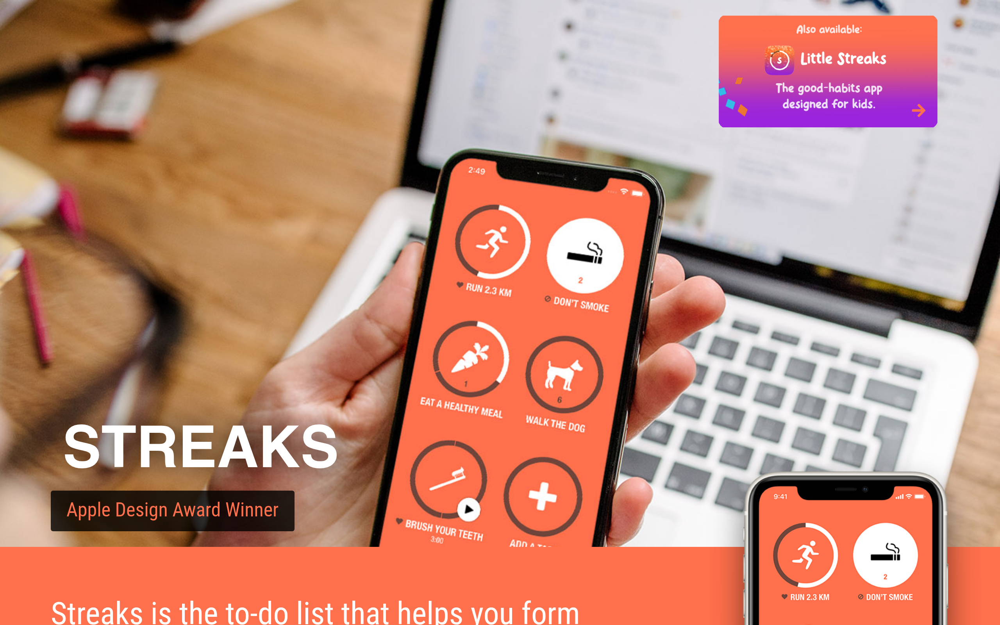

# streaksapp DESIGN.md

> Auto-generated design system — reverse-engineered via static analysis by skillui.
> Frameworks: None detected
> Colors: 20 · Fonts: 3 · Components: 2
> Icon library: not detected · State: not detected
> Primary theme: dark · Dark mode toggle: no · Motion: subtle

## Visual Reference

**Match this design exactly** — study colors, fonts, spacing, and component shapes before writing any UI code.



---

## 1. Visual Theme & Atmosphere

This is a **dark-themed** interface with a neutral tone. Depth is expressed through layered shadows and subtle surface color variation. Typography pairs **Roboto Condensed** for display/headings with **Helvetica Neue** for body text, creating clear visual hierarchy through type contrast. Spacing follows a **5px base grid** (standard density), with scale: 5, 10, 15, 20, 25, 30, 35, 40px. Motion is subtle — smooth transitions (150-300ms) ease state changes without drawing attention.

---

## 2. Color Palette & Roles

| Token | Hex | Role | Use |
|---|---|---|---|
| background | `#000000` | background | Page background, darkest surface |
| surface | `#333333` | surface | Card and panel backgrounds |
| text-primary | `#ffffff` | text-primary | Headings and body text |
| text-muted | `#777777` | text-muted | Captions, placeholders, secondary info |
| border | `#555555` | border | Dividers, card borders, outlines |
| danger | `#f9f2f4` | danger | Error states, destructive actions |
| success | `#3c763d` | success | Success states, positive indicators |
| warning | `#8a6d3b` | warning | Warning states, caution indicators |
| info | `#337ab7` | info | Informational highlights |
| unknown | `#a94442` | unknown | Palette color |
| unknown | `#e8e8e8` | unknown | Palette color |
| unknown | `#31708f` | unknown | Palette color |
| unknown | `#999999` | unknown | Palette color |
| unknown | `#fcf8e3` | unknown | Palette color |
| unknown | `#dddddd` | unknown | Palette color |
| unknown | `#dff0d8` | unknown | Palette color |
| unknown | `#f2dede` | unknown | Palette color |
| unknown | `#cccccc` | unknown | Palette color |
| unknown | `#23527c` | unknown | Palette color |
| unknown | `#286090` | unknown | Palette color |


---

## 3. Typography Rules

**Font Stack:**
- **Helvetica Neue** — Heading 1, Heading 2, Heading 3
- **Roboto Condensed** — Body, Caption
- **Menlo** — Code

**Font Sources:**

```css
@font-face {
  font-family: "Roboto Condensed";
  src: url("fonts/RobotoCondensed-Bold.ttf") format("truetype");
  font-weight: 700;
}
@font-face {
  font-family: "Roboto Condensed";
  src: url("fonts/RobotoCondensed-Regular.ttf") format("truetype");
  font-weight: 400;
}
```

| Role | Font | Size | Weight |
|---|---|---|---|
| Heading 1 | Helvetica Neue | 74px | 700 |
| Heading 2 | Helvetica Neue | 72px | 700 |
| Heading 3 | Helvetica Neue | 63px | 700 |
| Body | Roboto Condensed | 18px | 400 |
| Caption | Roboto Condensed | 12px | 400 |
| Code | Menlo | 14px | 400 |

**Typographic Rules:**
- Limit to 3 font families max per screen
- Use **Helvetica Neue** for body/UI text, **Roboto Condensed** for display/headings
- Maintain consistent hierarchy: no more than 3-4 font sizes per screen
- Headings use bold (600-700), body uses regular (400)
- Line height: 1.5 for body text, 1.2 for headings
- Use color and opacity for secondary hierarchy, not additional font sizes


---

## 4. Component Stylings

### Layout (1)

**Footer** — `html`

### Media (1)

**Image** — `html`


---

## 5. Layout Principles

- **Base spacing unit:** 5px
- **Spacing scale:** 5, 10, 15, 20, 25, 30, 35, 40, 50, 60, 80, 90
- **Border radius:** .1em, .25em, 1px, 3px, 4px, 5px, 6px, 8px, 10px, 15px
- **Max content width:** 1150px

**Spacing as Meaning:**
| Spacing | Use |
|---|---|
| 2.5-5px | Tight: related items within a group |
| 10px | Medium: between groups |
| 15-20px | Wide: between sections |
| 30px+ | Vast: major section breaks |


---

## 6. Depth & Elevation

### Flat — subtle depth hints

- `inset 0-1px 0 rgba(0,0,0,.25)`
- `inset 0 1px 1px rgba(0,0,0,.075)`
- `inset 0 1px 0 rgba(255,255,255,.1)`

### Raised — cards, buttons, interactive elements

- `inset 0 1px 1px rgba(0,0,0,.075),0 0 8px rgba(102,175,233,.6)`
- `inset 0 1px 1px rgba(0,0,0,.075),0 0 6px #67b168`
- `inset 0 1px 1px rgba(0,0,0,.075),0 0 6px #c0a16b`

### Floating — dropdowns, popovers, modals

- `0 6px 12px rgba(0,0,0,.175)`
- `0 3px 9px rgba(0,0,0,.5)`
- `0 5px 15px rgba(0,0,0,.5)`

### Z-Index Scale

`2, 3, 5, 10, 15, 990, 1000, 1030, 1040, 1050, 1060, 1070`


---

## 7. Animation & Motion

This project uses **subtle motion**. Transitions smooth state changes without demanding attention.

### CSS Animations

- `@keyframes progress-bar-stripes`
- `@keyframes fa-spin`

### Motion Guidelines

- Duration: 150-300ms for micro-interactions, 300-500ms for page transitions
- Easing: `ease-out` for enters, `ease-in` for exits
- Always respect `prefers-reduced-motion`


---

## 8. Do's and Don'ts

### Do's

- Use `#000000` as the primary page background
- Pair **Helvetica Neue** (body) with **Roboto Condensed** (display) — these are the only allowed fonts
- Follow the **5px** spacing grid for all margins, padding, and gaps
- Use the defined shadow tokens for elevation — see Section 6
- Use border-radius from the scale: .1em, .25em, 1px, 3px, 4px
- Reuse existing components from Section 4 before creating new ones

### Don'ts

- Don't introduce colors outside this palette — extend the design tokens first
- Don't introduce additional font families beyond Helvetica Neue and Roboto Condensed and Menlo
- Don't use arbitrary spacing values — stick to multiples of 5px
- Don't create custom box-shadow values outside the system tokens
- Don't use arbitrary border-radius values — pick from the defined scale
- Don't duplicate component patterns — check Section 4 first
- Don't use backdrop-blur or blur effects

### Anti-Patterns (detected from codebase)

- No blur or backdrop-blur effects
- No zebra striping on tables/lists


---

## 9. Responsive Behavior

| Name | Value | Source |
|---|---|---|
| md | 767px | css |
| md | 768px | css |
| lg | 769px | css |
| lg | 991px | css |
| lg | 992px | css |
| xl | 1199px | css |
| xl | 1200px | css |

**Approach:** Use `@media (min-width: ...)` queries matching the breakpoints above.


---

## 10. Agent Prompt Guide

Use these as starting points when building new UI:

### Build a Card

```
Background: #333333
Border: 1px solid #555555
Radius: 5px
Padding: 20px
Font: Helvetica Neue
Use shadow tokens from Section 6.
```

### Build a Button

```
Primary: bg var(--accent), text white
Ghost: bg transparent, border #555555
Padding: 10px 20px
Radius: 5px
Hover: opacity 0.9 or lighter shade
Focus: ring with var(--accent)
```

### Build a Page Layout

```
Background: #000000
Max-width: 1150px, centered
Grid: 5px base
Responsive: mobile-first, breakpoints from Section 9
```

### Build a Stats Card

```
Surface: #333333
Label: #777777 (muted, 12px, uppercase)
Value: #ffffff (primary, 24-32px, bold)
Status: use success/warning/danger from Section 2
```

### Build a Form

```
Input bg: #000000
Input border: 1px solid #555555
Focus: border-color var(--accent)
Label: #777777 12px
Spacing: 20px between fields
Radius: 5px
```

### General Component

```
1. Read DESIGN.md Sections 2-6 for tokens
2. Colors: only from palette
3. Font: Helvetica Neue, type scale from Section 3
4. Spacing: 5px grid
5. Components: match patterns from Section 4
6. Elevation: shadow tokens
```
